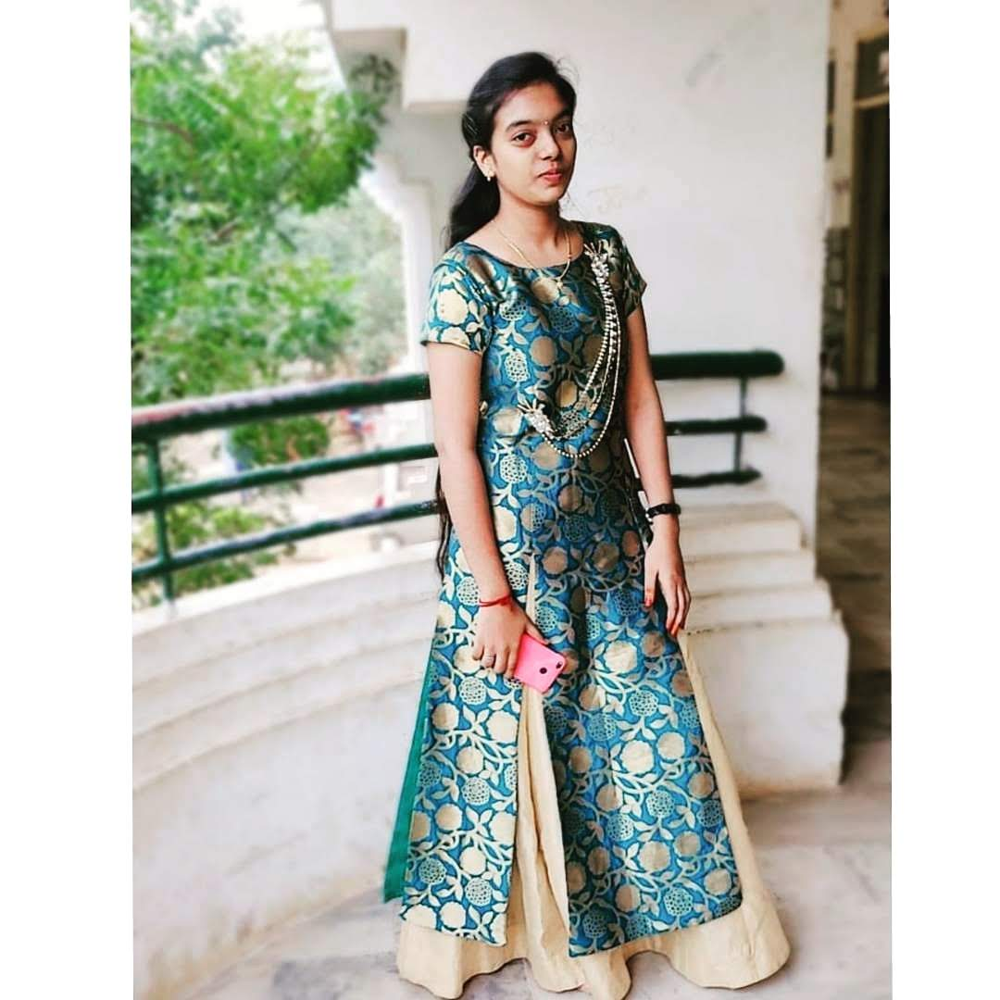

# Tejo Lakshmi Tata
I'm Tejo Lakshmi Tata, and I was born and raised in Bapatla, which is well-known for having Suryalanka Beach. I attended Gems High School and Graduated in 2021 from Vignan's Foundation for Science, Technology, and Research. I enjoy playing video games and am really interested in yoga when I have free time.

***
# Visiting Spots
The list of popular locations in a few cities, together with the amount of time spend there, is shown in the table below. 

|Name of a City|Location|Visting Time|
|--------------|--------|------------|
|Kolkata       |Cable Bridge | 1 hour|
|Bangalore     |Thottikollu Water Falls|6 hours|
|Vishakapatanam| Vanajangi Hills | 4 hours|
|Ahmedabad     |Statue of Unity |2 hours|
